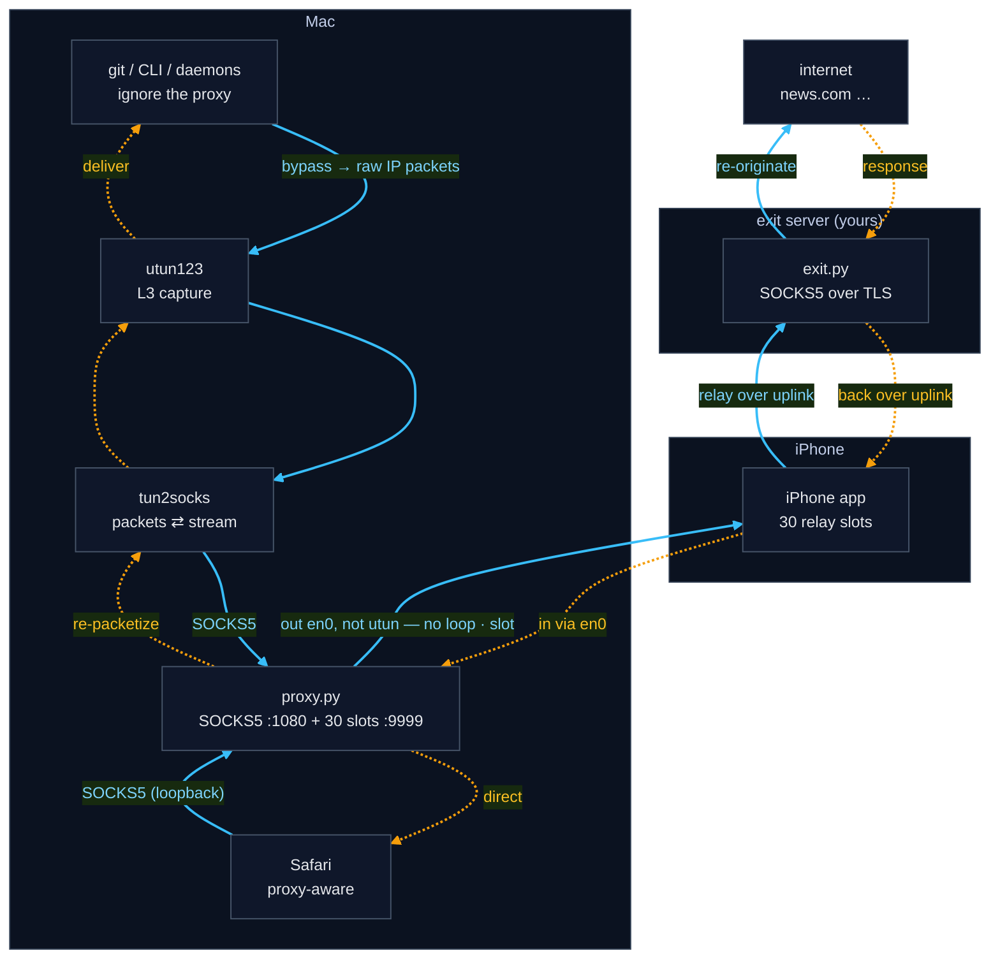
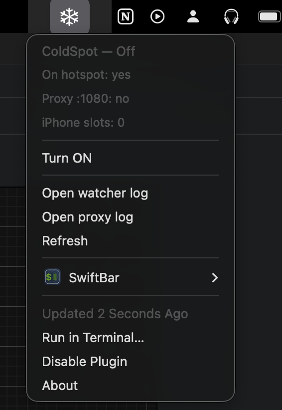
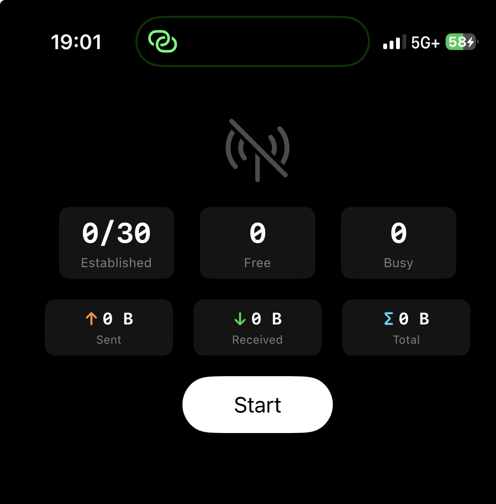

# ColdSpot — make your Mac disappear 🫥

*Your Mac goes quiet. The network just sees a server somewhere else doing the
talking.*

Route **all** of a Mac's traffic — every app, even ones that ignore proxy
settings — through a paired iPhone and out to a small **exit server you own**, so
the outside world meets your server's address instead of your Mac's. A
from-scratch look at how a VPN-like data path is actually built.

> **The code is in a private repo.** This page is the readable overview — if you
> want to experiment with it, [request access below](#-request-access).

## What it is

A virtual interface captures **all** of a Mac's traffic at Layer 3; `tun2socks`
turns those packets into a SOCKS stream; a reverse tunnel to a paired iPhone
carries each connection onward to a **self-hosted exit server you own**
(authenticated SOCKS5 over TLS) that re-originates it to the internet. Capturing
at Layer 3 means even apps that ignore proxy settings get caught; the iPhone is a
dumb relay, so the Mac↔exit conversation is end-to-end.

Built as **developer/educational material** — a working system to stand up and
learn from, end to end, not a product.

## How it works

Both directions in one figure — **blue solid = forward** (app → internet),
**amber dotted = return** (internet → app):

The iPhone is a **dumb pipe**: the Mac tells it only to dial the exit, then runs
TLS + authenticated SOCKS5 to the exit *through* that pipe, end-to-end — so the
connection to your server is encrypted and all config stays on the Mac.

## What it looks like

A ❄️ menu-bar toggle on the Mac, and a small relay app on the iPhone:

  
  &nbsp;&nbsp;
  

Setup is basically one command — it builds a free Oracle Always-Free exit server
for you (Terraform), installs it over SSH, and wires up the Mac. The iPhone app is
built once from Xcode.

## Concepts it demonstrates

- Layer-3 vs Layer-5 interception (and why lower = unavoidable)
- routing-table internals — longest-prefix match, non-destructive default override
- reverse-tunnel design (inbound slots a NAT'd device holds open)
- SOCKS5 (CONNECT + auth) and TLS with certificate pinning
- self-hosted cloud infrastructure as code (Terraform on Oracle Always-Free)
- automated, host-key-safe SSH config exchange
- fail-safe, self-healing background services (launchd)

## 🔑 Request access

The full source lives in a **private** repo. To try it:

👉 **[Open a "Request access" issue](../../issues/new?template=request-access.yml)**
with your **GitHub username**.

Once approved, you're added as a **read-only collaborator** on the private repo —
you can clone and run it, just not change it. Requests are reviewed manually, so
I'll see who's asking. 🙂
