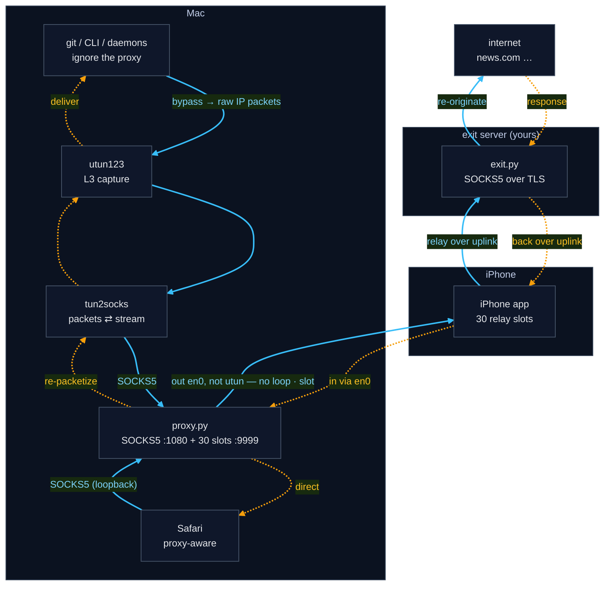

# ColdSpot — make your Mac disappear 🫥

*Your Mac goes quiet. The network just sees a server somewhere else doing the
talking.*

Route **all** of a Mac's traffic — every app, even ones that ignore proxy
settings — through a paired iPhone and out to a small **exit server you own**, so
the outside world meets your server's address instead of your Mac's. A
from-scratch look at how a VPN-like data path is actually built.

> **The code lives in a private repo.** Read on to see how it works — then
> **[request access](../../issues/new?template=request-access.yml)** with your
> GitHub username and you'll be added as a read-only collaborator so you can clone it.

## What it is

A virtual interface captures **all** of a Mac's traffic at Layer 3; `tun2socks`
turns those packets into a SOCKS stream; a reverse tunnel to a paired iPhone
carries each connection onward to a **self-hosted exit server you own**
(authenticated SOCKS5 over TLS) that re-originates it to the internet. Capturing
at Layer 3 means even apps that ignore proxy settings get caught; the iPhone is a
dumb relay, so the Mac↔exit conversation is end-to-end.

Built as **developer/educational material** — a working system to stand up and
learn from, end to end, not a product.

## How it works

Both directions in one figure — **blue solid = forward** (app → internet),
**amber dotted = return** (internet → app):



The iPhone is a **dumb pipe**: the Mac tells it only to dial the exit, then runs
TLS + authenticated SOCKS5 to the exit *through* that pipe, end-to-end — so the
connection to your server is encrypted and all config stays on the Mac.

📐 **Architecture & data-flow diagram:** [docs/ARCHITECTURE.md](docs/ARCHITECTURE.md) ·
🗺 **Roadmap:** [docs/ROADMAP.md](docs/ROADMAP.md) ·
🛠 **Setup:** [jump to Setup ↓](#setup)

## Repository layout
```
coldspot/
├── server/        the cloud exit server (runs on a free Oracle VM you own)
│   ├── exit.py            authenticated SOCKS5-over-TLS exit (re-originates to the internet)
│   ├── setup.sh           installs exit.py + cert + creds + systemd (pushed over SSH)
│   └── provision/         Terraform + provision.sh — one command builds the Oracle VM
│
├── mac/           host-side networking & orchestration (runs on the Mac)
│   ├── install.sh              one-command Mac installer (SSHes the server, fetches config)
│   ├── proxy.py                SOCKS5 + 30-slot iPhone pool + live leak dashboard
│   ├── coldspot.sh             manual launcher (sudo → runs proxy.py)
│   ├── coldspot-watch.sh       launchd watcher: toggle ON + hotspot → start, else tear down
│   ├── coldspot-toggle.sh      flip the menu-bar ON/OFF flag (~/.coldspot/enabled)
│   ├── lib/prompt.sh           interactive prompt helper for the installer
│   ├── swiftbar/coldspot.5s.sh SwiftBar menu-bar plugin (status + ON/OFF button)
│   ├── install-swiftbar.sh     symlink the plugin into SwiftBar's plugin folder
│   ├── coldspot-tun-ctl.sh     utun123 up/down/status engine (idempotent, safety-gated)
│   ├── coldspot-tun-up.sh      thin manual wrapper → tun-ctl up
│   ├── coldspot-tun-down.sh    thin manual wrapper → tun-ctl down
│   ├── com.coldspot.hotspot.plist   LaunchDaemon (templated at install time)
│   ├── install-autostart.sh    install + load the LaunchDaemon (portable paths)
│   ├── uninstall-autostart.sh  unload + remove it (back to fully manual)
│   └── tun2socks               L3<->L5 translator (binary; xjasonlyu/tun2socks)
│
├── ios/           the iPhone app (the 30-slot reverse relay) — unchanged
│   ├── ProxyTest/             Swift sources
│   └── ProxyTest.xcodeproj
│
└── docs/          ARCHITECTURE.md, ROADMAP.md
```

## Setup

Create an Oracle account, then run one command — everything else is automatic.

### ☁️ 1 · Create a free Oracle Cloud account

The only manual step: <https://signup.cloud.oracle.com>. Signup needs card + SMS
(the **Always-Free** tier doesn't charge you).

> [!TIP]
> When asked, **choose a Home Region near you** — it's **permanent** on a free
> account and your server lives in it, so remember which you pick (`provision.sh`
> re-asks for it).

<details>
<summary>The full signup walkthrough</summary>

1. Email + country + name → verify your email
2. Set a password + an account name
3. **Choose a Home Region** — permanent on a free account; your server lives in it
4. Phone / SMS code
5. Credit card (identity check only — Always-Free doesn't charge you)
6. Accept → the account provisions in a few minutes, then the console loads

</details>

### ⚡ 2 · Run it — one command builds the server *and* sets up your Mac

```bash
git clone https://github.com/codereyinish/coldspot.git
cd coldspot/server/provision
./provision.sh
```

When it finishes, the ❄️ ColdSpot toggle appears in your macOS menu bar:


<br>

### 📱 3 · Set up your iPhone (one-time)

ColdSpot's relay is a tiny app you run on your own phone — a **free Apple ID
works**. Build it once in Xcode:

1. Plug the iPhone in via USB, unlock it, tap **Trust This Computer**. Enable
   **Developer Mode** if asked (Settings → Privacy & Security → Developer Mode).
2. Open the project:  `open ios/ProxyTest.xcodeproj`
3. Select the **ProxyTest** target → **Signing & Capabilities** → set **Team** to
   your Apple ID **(Personal Team)**, and keep **Automatically manage signing** ✅.
4. Change the **Bundle Identifier** to something unique to you, e.g.
   `com.yourname.proxytest`. (A free team can't reuse an ID that's already
   registered, so make it yours.)
5. Pick your iPhone at the top → click **▶ Run**.
6. First launch shows *"Developer App Certificate is not trusted"* — expected. On
   the phone: Settings → **General → VPN & Device Management** → your Apple ID →
   **Trust**. Then hit **▶ Run** again (or just open the app).
7. In the app, tap **Start**.

The app looks like this — tap **Start** and it opens the 30 relay slots (the
counters start filling once the Mac is on the hotspot with ❄️ ON):


> [!NOTE]
> A free signing certificate expires after ~7 days. When the app stops opening,
> just **▶ Run** it again from Xcode.

### ❄️ 4 · Turn it on

Connect the Mac to the iPhone's **Personal Hotspot**, then click the ❄️ menu-bar
icon and choose **Turn ON**:


The menu also shows live status (on hotspot? proxy up? how many iPhone slots).
Then confirm the whole chain works:

```bash
curl https://ifconfig.me      # should print your server's IP, not your home one
```

> [!NOTE]
> After a reboot ColdSpot stays **off** until you flip ❄️ ON again.
