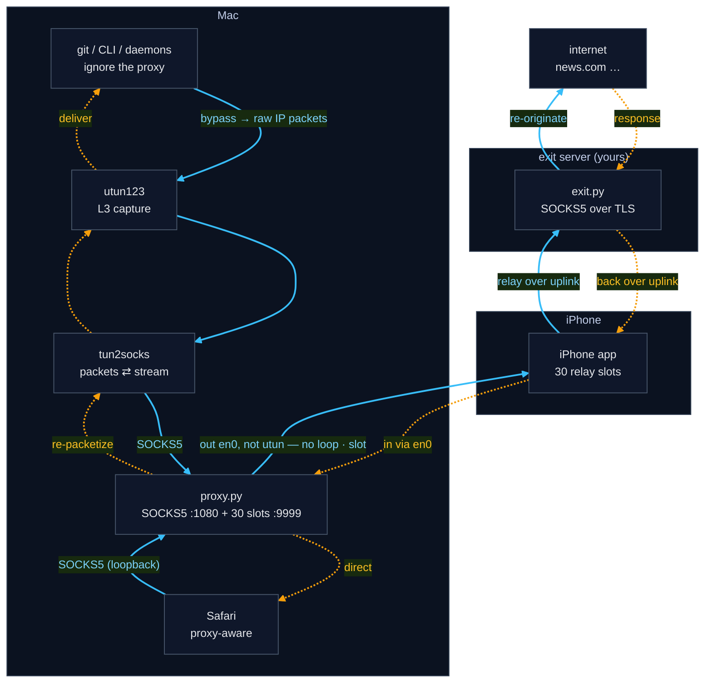

# ColdSpot — Architecture

A **system-wide transparent proxy** that routes *all* of a Mac's traffic — even
apps with no proxy support — out through an **exit server you own**. A virtual
interface captures traffic at the **IP layer (Layer 3)**; `tun2socks` converts
those packets into a SOCKS stream; a **reverse tunnel** to a paired iPhone carries
each connection onward to a self-hosted exit (authenticated SOCKS5 over TLS) that
re-originates it to the internet. Capturing at Layer 3 means even apps that ignore
proxy settings get caught; the iPhone is a dumb relay, so the Mac↔exit
conversation is end-to-end.

---

## 1. The problem

```
GOAL: route a Mac's internet traffic out through an iPhone's cellular link,
      system-wide, including apps that know nothing about proxies.

├── Apps that support proxies (Safari)        → easy: point them at a SOCKS proxy
└── Apps that DON'T (git, CLIs, OS daemons)    → ignore proxy settings → they LEAK
        └── must be captured WITHOUT cooperation   ← the hard part
```

The two halves of the solution:

- **The tunnel** — get traffic from the Mac to the iPhone and out to the exit.
- **The capture** — force *every* app's traffic into that tunnel, even uncooperative ones.

---

## 2. High-level data flow

Both directions in one figure — **blue solid = forward** (app → internet),
**amber dotted = return** (internet → app):



Two entry paths converge at `proxy.py` — Safari via SOCKS5, everything else via
L3 capture (`utun123 → tun2socks`) — then leave over **en0, never utun** (that's
what stops the loop) through a slot to the phone and out to the exit. On the way
back they **diverge again**: `proxy.py` writes straight to Safari's socket
(**direct**), while git's bytes are **re-packetized** into utun. The
`proxy.py ↔ exit` leg (SOCKS5 auth + TLS) is **end-to-end** — the iPhone only
shuttles bytes, never seeing the real destination.

---

## 3. Future work / improvements

- **Idle-slot reaper** — reclaim slots held by persistent idle connections
  (WebSockets, keepalives, DoH), but only under pressure (watermark-gated) to
  avoid needless reconnect churn.
- **UDP / QUIC** — the slots are TCP-only (SOCKS5 CONNECT), so UDP falls back to
  TCP; real support needs SOCKS5 UDP-ASSOCIATE or a TUN-level UDP path.
- **Adaptive pool sizing** — the pool is fixed at 30; it could shrink when idle
  and grow under sustained load.

See [ROADMAP.md](ROADMAP.md) for the fuller security roadmap (UDP path, the
WireGuard-deferred analysis, per-device credentials).
